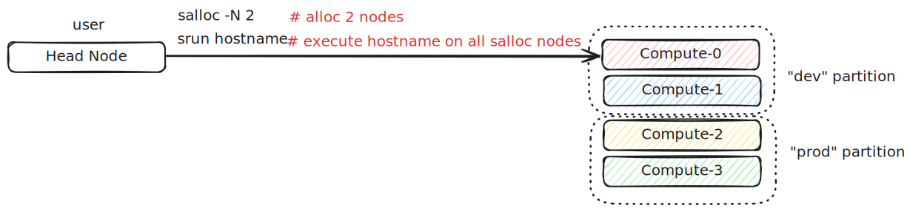

.. meta::
    :description lang=en: Slurm cheat sheet for HPC job scheduling, batch jobs, distributed training, MPI, Enroot containers, and cluster management commands
    :keywords: Slurm, HPC, job scheduler, sbatch, srun, salloc, distributed training, MPI, Enroot, Pyxis, cluster computing, workload manager, GPU cluster, machine learning, PyTorch distributed

=====
Slurm
=====

.. contents:: Table of Contents
    :backlinks: none

Slurm (Simple Linux Utility for Resource Management) is an open-source job scheduling
and workload management system widely used in high-performance computing (HPC) clusters.
It is designed to efficiently allocate resources, manage queues, and dispatch jobs across
large numbers of compute nodes. Slurm is the de facto standard for HPC job scheduling,
powering many of the world's largest supercomputers and GPU clusters used for scientific
computing, machine learning, and AI research.

For machine learning engineers, Slurm provides a straightforward way to launch distributed
training jobs for large language models (LLMs) and deep learning workloads sharded across
multiple nodes. Unlike container orchestration systems like Kubernetes—which often require
additional components such as Kubeflow for ML workload scheduling—Slurm provides a simpler,
HPC-focused workflow. Users can submit and manage jobs directly with commands like ``srun``,
``sbatch``, and ``squeue``, without needing to configure complex orchestration layers.

This cheat sheet covers essential Slurm commands and workflows for submitting jobs, managing
resources, running distributed training with PyTorch, launching MPI applications, and using
containers with Enroot and Pyxis.

Slurm Info
----------

``sinfo`` is a command used to display general information about a Slurm-managed
cluster, such as the number of available nodes and partitions. It also allows
users to check the status of nodes, including identifying nodes that are down or
in an error state.

.. code-block:: bash

    # show slurm general info
    sinfo

    # show partition info
    sinfo -s
    sinfo --summarize

    # show partition info
    PARTITION=dev
    sinfo -p ${PARTITION}

    # show nodes in idle state
    sinfo --state=idle

    # show nodes in specific format
    sinfo -o "%n %P %t %C"  # node, partition, state, CPUs

    # show GPU info (if configured)
    sinfo -o "%n %G"

Node Info
---------

``scontrol show node`` provides detailed information about specific nodes in the
cluster, including CPU count, memory, GPU resources, and current state. This is
useful for debugging node issues or verifying hardware configurations.

.. code-block:: bash

    # show all nodes info
    scontrol show nodes

    # show specific node info
    scontrol show node compute-01

    # show node in parseable format
    scontrol show node compute-01 --oneliner

    # list all hostnames
    scontrol show hostnames

    # expand node range to list
    scontrol show hostnames compute-[0-5]

    # show nodes in idle state
    sinfo --state=idle

Submit Jobs
-----------

Launching a job across multiple nodes in the foreground is straightforward with
``srun``. For example, running ``srun hostname`` will execute the ``hostname`` command
on multiple allocated nodes and wait for all nodes to return results. With ``srun``,
users can easily specify:

* Number of nodes to run the job on (``--nodes``)
* Partition or queue to submit the job to (``--partition``)
* Time limit for the job (``--time``), ensuring compute resources are automatically released when the job finishes or reaches its time limit

By default, ``srun`` runs interactively in the foreground, making it ideal for quick
tests or debugging. For longer or batch jobs, users typically pair srun with job
scripts submitted via ``sbatch``.

.. code-block:: bash

    # Submit a job to a compute node
    srun -N1 hostname

    # Submit a job on specific nodes
    srun --nodelist=compute-[0-5] hostname

    # Submit a job to a specific partition
    PARTITION=dev
    srun -p ${PARTITION} --nodelist=compute-[0-5] hostname

    # Submit a job via srun on 2 nodes (using dd to simulate a high CPU consume job)
    srun -N2 dd if=/dev/zero of=/dev/null

    # Submit a job with time constrain.
    # - minute
    # - minute:second
    # - hours:minutes:seconds
    # - days-hours
    # - days-hours:minutes
    # - days-hours:minutes:seconds
    #
    # ex: The following job will be timeout after 1m30s
    srun -N2 --time=01:30 dd if=/dev/zero of=/dev/null

    # login to a node
    srun -N 1 --pty /bin/bash

Alloc Nodes
-----------

In some scenarios, users may need exclusive, interactive access to specific
nodes for experiments or testing. For instance, a researcher running benchmarking
tests might require all benchmarks to execute on the same fixed nodes to ensure
consistent and reproducible results. The salloc command is used to request and
allocate resources interactively. By using ``salloc``, users can reserve a specific
number of nodes, ensuring that no other jobs are scheduled on them during the
experiment. This isolation helps avoid resource contention that could affect
benchmarking or performance measurements. For example, the following command
allocates 2 nodes for an interactive session:

.. code-block:: bash

    # Allocte 2 nodes and submit a job on those allocated nodes
    salloc -N 2
    srun hostname
    exit # release allocated nodes

    # Allocate nodes on a specific partition
    PARTITION=dev
    salloc -N 2 -p ${PARTITION}

.. note::

    ``salloc`` is particularly useful for:

    * Interactive debugging
    * Benchmarking and performance testing
    * Running exploratory workloads without writing a full job script

Cancel Jobs
-----------

Users may occasionally need to cancel their jobs for various reasons. For example,
a cluster administrator may announce maintenance (such as upgrading system libraries),
requiring users to terminate running jobs. In other cases, a job might hang or
consume compute resources unnecessarily, making cancellation necessary. Slurm
provides the ``scancel`` command to terminate jobs cleanly. Example usage:

.. code-block:: bash

    # cancel a job
    scancel "${jobid}"

    # cancel a job and disable warnings
    scancel -q "${jobid}"

    # cancel all jobs which are belong to an account
    scancel --account="${account}"

    # cancel all jobs which are belong to a partition
    scancel --partition="${partition}"

    # cancel all pending jobs
    scancel --state="PENDING"

    # cancel all running jobs
    scancel --state="RUNNING"

    # cancel all jobs
    squeue -l | awk '{ print $ 1}' | grep '[[:digit:]].*' | xargs scancel

    # cancel all jobs (using state option)
    for s in "RUNNING" "PENDING" "SUSPAND"; do scancel --state="$s"; done

Submit Batch Jobs
-----------------

``sbatch`` is a Slurm command used to submit batch jobs for execution on a
cluster. Unlike ``srun``, which typically runs jobs interactively in the foreground,
``sbatch`` is designed for running long, non-interactive workloads in the background.
This allows users to submit jobs without maintaining an active SSH session to the
cluster's head node, making it ideal for large-scale or time-consuming tasks.

A typical workflow involves writing a Slurm job script containing job specifications
(such as the number of nodes, time limits, and partitions) and one or more srun
commands to execute programs. Submitting this script with sbatch queues the job,
and Slurm automatically schedules it based on available resources. Example sbatch
script:

.. code-block:: bash

    #!/bin/bash
    #SBATCH --nodelist=compute-[0-1]
    #SBATCH --output=logs/%x_%j.out
    #SBATCH --error=logs/%x_%j.out
    #SBATCH --ntasks-per-node=8

    master_addr="$(scontrol show hostnames | sort | head -n 1)"
    srun hostname
    srun torchrun \
      --nproc-per-node="$SLURM_NPROCS" \
      --nnodes="$SLURM_NNODES"
      --master-addr="${master_addr}" \
      --master-port=29500 \
      ${PWD}/train.py

    # sbatch job.sh

Submit mpirun
-------------

In some HPC environments, users may not be able to load the MPI module directly
on the head (login) node due to security restrictions, minimal software installations,
or site policies that restrict heavy workloads on login nodes. In such cases,
the workflow is to use Slurm to allocate compute nodes and launch ``mpirun`` from
within one of those nodes. From there, mpirun orchestrates the execution of the
MPI program across all allocated nodes.

.. image:: images/mpirun.svg

.. code-block:: bash

    #!/bin/bash

    # Usage:
    #
    # rank_per_node=8
    # salloc -N 4
    # ./mpirun.sh ${rank_per_node} ${binary}

    launch() {
      local rank_per_node="${1}"
      local args=("${@:2}")
      local arr
      local hosts
      local cmd

      mapfile -t arr < <(scontrol show hostnames | sort)
      OLDIFS="${IFS}"
      IFS=","
      hosts="${arr[*]}"
      IFS="${OLDIFS}"

      cmd="$(cat <<EOF

      mpirun \
      -N "${rank_per_node}" \
      --allow-run-as-root \
      --host "${hosts}" \
      --mca pml ^cm --mca plm_rsh_no_tree_spawn 1 \
      --mca btl_tcp_if_exclude lo,docker0,veth_def_agent \
      --mca plm_rsh_num_concurrent "${#arr[@]}" \
      --mca btl_vader_single_copy_mechanism none \
      --oversubscribe \
      --tag-output \
      ${args[@]}

    EOF
    )"

      # submit a mpirun job to a single node because mpirun will launch jobs on
      # other nodes. Therfore, it is required to spcify -N 1 when using srun.
      srun -N 1 bash -c "${cmd}"
    }

    launch "$@"

Submit Jobs with Enroot
-----------------------

Sometimes, users need to run jobs with custom dependencies that differ from the
cluster’s system-wide environment. For example, if the cluster is configured with
NCCL 2.23 but a user wants to benchmark NCCL 2.27, it’s often impractical to ask
administrators to upgrade or modify system libraries for a single experiment.
One workaround is to create a custom container (e.g., Docker image) with the
required dependencies and launch jobs from that environment. However, running
containers in HPC environments often requires extra setup and special flags
due to namespace isolation and security restrictions.

To simplify this process, `Enroot <https://github.com/NVIDIA/enroot>`_ provides
a lightweight alternative to traditional container runtimes. It allows users to
run isolated filesystem in an HPC setting with minimal overhead, similar to
``chroot``, while still granting direct access to system hardware (e.g., GPUs, interconnects).
This makes it ideal for ML and HPC workflows that require fine-tuned performance.

Building on Enroot, `Pyxis <https://github.com/NVIDIA/pyxis>`_ is a Slurm plugin
that enables launching jobs inside Enroot containers without writing additional
wrapper scripts. Users can specify Enroot squash file and runtime options directly
in their sbatch or srun commands, integrating container workflows seamlessly into
Slurm job submission. The following snippet shows serveral to launch a job through
Enroot and Pyxis.

.. code-block:: bash

   # build an enroot sqsh file
   $ enroot import -o "${output_sqsh}" "dockerd://${image}"

   # submit a job with enroot
   srun --container-image "${output_sqsh}" \
     --container-mounts "/fsx:/fsx,/nfs:/nfs" \
     --ntasks-per-node=8 \
     ${cmd}

   # submit a mpi job with enroot
   srun --container-image "${output_sqsh}" \
     --container-mounts "/fsx:/fsx,/nfs:/nfs" \
     --ntasks-per-node=8 \
     --mpi=pmix \
     ${cmd}

Job Status
----------

To monitor the status of jobs in a Slurm-managed cluster, users can use the
``squeue`` command. This tool shows essential details about submitted jobs, such
as job IDs, job names, partitions, allocated nodes, and job states. Common job
states include:

* RUNNING – The job is actively running on allocated resources.
* PENDING – The job is waiting in the queue for resources to become available.
* FAILED – The job has failed due to errors or unmet conditions.

If a job is stuck, fails, or behaves unexpectedly, you can terminate it with
the ``scancel`` command and resubmit after fixing the issue.

.. code-block:: bash

   # check all Slurm jobs status
   squeue

   # check user's job status
   squeue --user=${USER}

Reservation
-----------

From an administrator’s perspective, it may be necessary to reserve specific
nodes to prevent Slurm from scheduling jobs on them. For example, nodes
experiencing hardware or software issues—such as network failures or disk
errors—should be reserved to avoid job failures. Reserving nodes allows
administrators to troubleshoot, repair, or perform maintenance without
interfering with active workloads. The following snippet demonstrates how to
create reservations through ``scontrol`` for nodes and check their reservation status.

.. code-block:: bash

    # reserve nodes for a user to test
    # - minute
    # - minute:second
    # - hours:minutes:seconds
    # - days-hours
    # - days-hours:minutes
    # - days-hours:minutes:seconds
    #
    # ex: reserve all nodes 120m for maintenance
    scontrol create reservation ReservationName=maintenance \
        starttime=now duration=120 user=root flags=maint,ignore_jobs nodes=ALL

    # must specify reservation; otherwise, the job will not run
    srun --reservation=maintain ping 8.8.8.8 2>&1 > /dev/null

    # show reservations
    scontrol show res

    # delete a reservation
    scontrol delete ReservationName=maintain

    # drain nodes for maintenance. ex: nodes=compute-[01-02],compute-08
    scontrol update NodeName=compute-[01-02],compute-08 State=DOWN Reason=”maintenance”

    # resume nodes
    scontrol update NodeName=compute-[01-02],compute-08 State=Resume

Accounting
----------

Slurm includes a powerful accounting and resource management system that allows
administrators to control how computing resources are allocated and ensure fair
usage across all users. Through this system, administrators can configure fairshare
scheduling, job priority policies, and resource limits to prevent individual
users or groups from monopolizing cluster resources for extended periods.

With ``fairshare``, Slurm dynamically adjusts job priorities based on historical
resource usage, ensuring that users who have consumed fewer resources get higher
priority in the job queue, while heavy users may experience lower priority until
usage balances out. This helps maintain equitable access in multi-user HPC environments.
Administrators manage these policies through Slurm’s database-backed accounting
system (``slurmdbd``) and commands like:

.. code-block:: bash

    # create a cluster (the clustername should be identical to ClusterName in slurm.conf)
    sacctmgr add cluster clustername

    # create an account
    sacctmgr -i add account worker description="worker account" Organization="your.org"

    # create an user and add to an account
    sacctmgr create user name=worker DefaultAccount=default

    # create an user and add to additional accounts
    sacctmgr -i create user "worker" account="worker" adminlevel="None"

    # modify user fairshare configuration
    sacctmgr modify user where name="worker" account="worker" set fairshare=0

    # remove an user from an account
    sacctmgr remove user "worker" where account="worker"

    # show all users
    sacctmgr show account

    # show all users with associations
    sacctmgr show account -s

Job History
-----------

``sacct`` displays accounting data for completed and running jobs. This is essential
for analyzing job performance, debugging failed jobs, and tracking resource usage
over time. Unlike ``squeue`` which only shows active jobs, ``sacct`` can retrieve
historical job information from the Slurm accounting database.

.. code-block:: bash

    # show recent jobs for current user
    sacct

    # show jobs from specific date range
    sacct --starttime=2024-01-01 --endtime=2024-01-31

    # show specific job details
    sacct -j ${jobid} --format=JobID,JobName,Partition,State,ExitCode,Elapsed

    # show detailed resource usage
    sacct -j ${jobid} --format=JobID,MaxRSS,MaxVMSize,AveRSS,AveCPU

    # show all fields
    sacct -j ${jobid} --format=ALL

    # show jobs with specific state
    sacct --state=FAILED --starttime=2024-01-01

    # common format for debugging
    sacct -j ${jobid} --format=JobID,JobName,State,ExitCode,DerivedExitCode,Comment

Environment Variables
---------------------

Slurm sets various environment variables when a job runs, providing information
about the job's allocation and configuration. These variables are essential for
writing portable job scripts that adapt to different resource allocations.

.. code-block:: bash

    # Common Slurm environment variables
    echo $SLURM_JOB_ID          # Job ID
    echo $SLURM_JOB_NAME        # Job name
    echo $SLURM_JOB_NODELIST    # List of allocated nodes
    echo $SLURM_JOB_NUM_NODES   # Number of nodes allocated
    echo $SLURM_NNODES          # Same as SLURM_JOB_NUM_NODES
    echo $SLURM_NTASKS          # Total number of tasks
    echo $SLURM_NTASKS_PER_NODE # Tasks per node
    echo $SLURM_CPUS_PER_TASK   # CPUs per task
    echo $SLURM_PROCID          # MPI rank (global)
    echo $SLURM_LOCALID         # Local task ID on node
    echo $SLURM_NODEID          # Node ID in allocation
    echo $SLURM_SUBMIT_DIR      # Directory where job was submitted
    echo $SLURM_GPUS            # Number of GPUs (if allocated)
    echo $SLURM_GPUS_PER_NODE   # GPUs per node

GPU Jobs
--------

For machine learning and deep learning workloads, requesting GPU resources is
essential. Slurm supports GPU scheduling through the Generic Resource (GRES)
plugin. Users can request specific numbers of GPUs, GPU types, or GPUs per task.

.. code-block:: bash

    # request 1 GPU
    srun --gres=gpu:1 nvidia-smi

    # request 4 GPUs
    srun --gres=gpu:4 python train.py

    # request specific GPU type (if configured)
    srun --gres=gpu:a100:2 python train.py

    # request GPUs per task
    srun --ntasks=4 --gres=gpu:4 --gpus-per-task=1 python train.py

    # sbatch example with GPUs
    #!/bin/bash
    #SBATCH --nodes=2
    #SBATCH --ntasks-per-node=8
    #SBATCH --gres=gpu:8
    #SBATCH --cpus-per-task=12

    srun python train.py

PyTorch Distributed Training
----------------------------

Launching distributed PyTorch training jobs on Slurm requires coordinating
multiple processes across nodes. The ``torchrun`` launcher simplifies this by
handling process spawning and environment setup. Here's a complete example for
multi-node distributed training.

.. code-block:: bash

    #!/bin/bash
    #SBATCH --job-name=distributed-train
    #SBATCH --nodes=4
    #SBATCH --ntasks-per-node=1
    #SBATCH --gpus-per-node=8
    #SBATCH --cpus-per-task=96
    #SBATCH --output=logs/%x_%j.out
    #SBATCH --error=logs/%x_%j.err

    # Get master node address
    MASTER_ADDR=$(scontrol show hostnames $SLURM_JOB_NODELIST | head -n 1)
    MASTER_PORT=29500

    # Set environment variables for distributed training
    export NCCL_DEBUG=INFO
    export NCCL_IB_DISABLE=0
    export NCCL_NET_GDR_LEVEL=2

    srun torchrun \
        --nnodes=$SLURM_NNODES \
        --nproc_per_node=8 \
        --rdzv_id=$SLURM_JOB_ID \
        --rdzv_backend=c10d \
        --rdzv_endpoint=$MASTER_ADDR:$MASTER_PORT \
        train.py --batch-size=32 --epochs=100

For containerized environments using Enroot and Pyxis, add ``--container-image``
to run training inside a custom container with specific CUDA, PyTorch, or NCCL versions.
Use ``--container-env`` to pass environment variables into the container:

.. code-block:: bash

    #!/bin/bash
    #SBATCH --job-name=distributed-train
    #SBATCH --nodes=4
    #SBATCH --ntasks-per-node=1
    #SBATCH --gpus-per-node=8
    #SBATCH --cpus-per-task=96
    #SBATCH --output=logs/%x_%j.out

    MASTER_ADDR=$(scontrol show hostnames $SLURM_JOB_NODELIST | head -n 1)
    MASTER_PORT=29500

    srun --container-image=/path/to/pytorch-24.01.sqsh \
         --container-mounts="/data:/data,${PWD}:/workspace" \
         --container-workdir=/workspace \
         --container-env="NCCL_DEBUG=INFO,NCCL_IB_DISABLE=0,NCCL_NET_GDR_LEVEL=2" \
         torchrun \
            --nnodes=$SLURM_NNODES \
            --nproc_per_node=8 \
            --rdzv_id=$SLURM_JOB_ID \
            --rdzv_backend=c10d \
            --rdzv_endpoint=$MASTER_ADDR:$MASTER_PORT \
            train.py --batch-size=32 --epochs=100

Array Jobs
----------

Array jobs allow submitting multiple similar jobs with a single ``sbatch`` command.
Each job in the array runs independently with a unique ``SLURM_ARRAY_TASK_ID``,
making it ideal for parameter sweeps, hyperparameter tuning, or processing multiple
datasets.

.. code-block:: bash

    #!/bin/bash
    #SBATCH --job-name=array-job
    #SBATCH --array=0-9
    #SBATCH --output=logs/array_%A_%a.out

    # SLURM_ARRAY_JOB_ID  - Job array's master job ID
    # SLURM_ARRAY_TASK_ID - Job array index (0-9 in this case)

    echo "Array task ID: $SLURM_ARRAY_TASK_ID"
    python train.py --seed=$SLURM_ARRAY_TASK_ID

    # Submit array job
    # sbatch array_job.sh

    # Submit with step size (0, 2, 4, 6, 8)
    #SBATCH --array=0-9:2

    # Submit with max concurrent tasks
    #SBATCH --array=0-99%10  # max 10 running at once

    # Cancel specific array tasks
    scancel ${jobid}_5      # cancel task 5
    scancel ${jobid}_[1-3]  # cancel tasks 1-3

Job Dependencies
----------------

Job dependencies allow you to control the execution order of jobs. A job can
wait for another job to complete, succeed, or fail before starting. This is
useful for creating pipelines where preprocessing must finish before training.

.. code-block:: bash

    # Submit first job
    JOB1=$(sbatch --parsable preprocess.sh)

    # Submit second job after first completes successfully
    JOB2=$(sbatch --parsable --dependency=afterok:$JOB1 train.sh)

    # Submit third job after second completes (regardless of status)
    sbatch --dependency=afterany:$JOB2 postprocess.sh

    # Dependency types:
    # after:jobid       - start after job begins
    # afterok:jobid     - start after job completes successfully
    # afternotok:jobid  - start after job fails
    # afterany:jobid    - start after job completes (any status)
    # singleton         - only one job with same name runs at a time

    # Multiple dependencies
    sbatch --dependency=afterok:$JOB1:$JOB2 final.sh

Resource Limits
---------------

Setting appropriate resource limits helps ensure fair cluster usage and prevents
jobs from consuming excessive resources. Slurm allows specifying memory, CPU,
and time limits per job.

.. code-block:: bash

    # Memory per node
    srun --mem=64G python train.py

    # Memory per CPU
    srun --mem-per-cpu=4G python train.py

    # CPU limit
    srun --cpus-per-task=8 python train.py

    # Time limit (job killed if exceeded)
    srun --time=24:00:00 python train.py

    # Exclusive node access (no sharing)
    srun --exclusive python train.py

    # sbatch example with limits
    #!/bin/bash
    #SBATCH --mem=128G
    #SBATCH --cpus-per-task=32
    #SBATCH --time=48:00:00
    #SBATCH --exclusive

Debugging Failed Jobs
---------------------

When jobs fail, Slurm provides several tools to diagnose the issue. Common
problems include out-of-memory errors, time limits exceeded, and node failures.

.. code-block:: bash

    # Check job exit code and state
    sacct -j ${jobid} --format=JobID,State,ExitCode,DerivedExitCode

    # Common exit codes:
    # 0     - Success
    # 1     - General error
    # 137   - OOM killed (128 + 9 SIGKILL)
    # 143   - Time limit (128 + 15 SIGTERM)

    # Check job's stderr/stdout
    cat slurm-${jobid}.out

    # Check why job is pending
    squeue -j ${jobid} --format="%i %r"

    # Common pending reasons:
    # Resources    - Waiting for resources
    # Priority     - Lower priority than other jobs
    # Dependency   - Waiting for dependent job
    # QOSMaxJobsPerUserLimit - User job limit reached

    # Show detailed job info
    scontrol show job ${jobid}

    # Check node health where job ran
    scontrol show node ${nodename}
