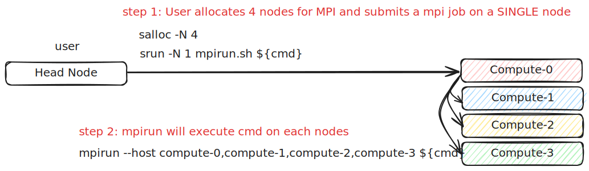

.. meta::
    :description lang=en: Collect useful snippets of Slurm
    :keywords: Python, Python3, Slurm

=====
Slurm
=====

Slurm Info
----------

.. code-block:: bash

    # show slurm general info
    sinfo

    # show partition info
    sinfo -s
    sinfo --summarize

    # show partition info
    PARTITION=dev
    sinfo -p ${PARTITION}

    # show nodes in idle state
    sinfo --state=idle

Submit Jobs
-----------

.. code-block:: bash

    # Submit a job to a compute node
    srun -N1 hostname

    # Submit a job on specific nodes
    srun --nodelist=compute-[0-5] hostname

    # Submit a job to a specific partition
    PARTITION=dev
    srun -p ${PARTITION} --nodelist=compute-[0-5] hostname

    # Submit a job via srun on 2 nodes (using dd to simulate a high CPU consume job)
    srun -N2 dd if=/dev/zero of=/dev/null

    # Submit a job with time constrain.
    # - minute
    # - minute:second
    # - hours:minutes:seconds
    # - days-hours
    # - days-hours:minutes
    # - days-hours:minutes:seconds
    #
    # ex: The following job will be timeout after 1m30s
    srun -N2 --time=01:30 dd if=/dev/zero of=/dev/null

    # login to a node
    srun -N 1 --pty /bin/bash

Alloc Nodes
-----------

.. code-block:: bash

    # Allocte 2 nodes and submit a job on those allocated nodes
    salloc -N 2
    srun hostname

    # Allocate nodes on a specific partition
    PARTITION=dev
    salloc -N 2 -p ${PARTITION}

Reservation
-----------

.. code-block:: bash

    # reserve nodes for a user to test
    # - minute
    # - minute:second
    # - hours:minutes:seconds
    # - days-hours
    # - days-hours:minutes
    # - days-hours:minutes:seconds
    #
    # ex: reserve all nodes 120m for maintenance
    scontrol create reservation ReservationName=maintenance \
        starttime=now duration=120 user=root flags=maint,ignore_jobs nodes=ALL

    # must specify reservation; otherwise, the job will not run
    srun --reservation=maintain ping 8.8.8.8 2>&1 > /dev/null

    # show reservations
    scontrol show res

    # delete a reservation
    scontrol delete ReservationName=maintain

Cancel Jobs
-----------

.. code-block:: bash

    # cancel a job
    $ scancel "${jobid}"

    # cancel a job and disable warnings
    $ scancel -q "${jobid}"

    # cancel all jobs which are belong to an account
    $ scancel --account="${account}"

    # cancel all jobs which are belong to a partition
    $ scancel --partition="${partition}"

    # cancel all pending jobs
    $ scancel --state="PENDING"

    # cancel all running jobs
    $ scancel --state="RUNNING"

    # cancel all jobs
    $ squeue -l | awk '{ print $ 1}' | grep '[[:digit:]].*' | xargs scancel

    # cancel all jobs (using state option)
    $ for s in "RUNNING" "PENDING" "SUSPAND"; do scancel --state="$s"; done

Submit Batch Jobs
-----------------

.. code-block:: bash

    #!/bin/bash
    #SBATCH --nodelist=compute-[0-1]
    srun hostname

    # sbatch job.sh

.. code-block:: bash

    #!/bin/bash

    #SBATCH --output=logs/%x_%j.out
    #SBATCH --error=logs/%x_%j.out

    HOSTFILE="hosts_${SLURM_JOB_ID}"
    scontrol show hostnames | sort > "$HOSTFILE"

    # sbatch hostname.sh

Submit mpirun
-------------

.. code-block:: bash

    rank_per_node=8
    salloc -N 4
    srun -N 1 ${PWD}/mpi.sh ${rank_per_node} ${binary}

.. code-block:: bash

    #!/bin/bash

    # mpirun.sh

    launch() {
      local rank_per_node="${1}"
      local args=("${@:2}")
      local arr
      local hosts
      local cmd

      mapfile -t arr < <(scontrol show hostnames | sort)
      OLDIFS="${IFS}"
      IFS=","
      hosts="${arr[*]}"
      IFS="${OLDIFS}"

      cmd="$(cat <<EOF

      /usr/bin/mpirun \
      -N "${rank_per_node}" \
      --allow-run-as-root \
      --host "${hosts}" \
      --mca pml ^cm --mca plm_rsh_no_tree_spawn 1 \
      --mca btl_tcp_if_exclude lo,docker0,veth_def_agent \
      --mca plm_rsh_num_concurrent "${#arr[@]}" \
      --mca btl_vader_single_copy_mechanism none \
      --oversubscribe --tag-output \
      -x FI_PROVIDER=efa \
      -x RDMAV_FORK_SAFE=1 \
      -x FI_EFA_USE_DEVICE_RDMA=1 \
      -x NCCL_SOCKET_IFNAME=^lo,docker0 \
      -x NCCL_ALGO=ring \
      -x HDF5_USE_FILE_LOCKING=FALSE \
      -x NCCL_DEBUG=warn \
      -x LD_LIBRARY_PATH \
      -x MEM_EFFICIENT_LINEAR=1 \
      ${args[@]}

    EOF
    )"

      # submit a mpirun job to a single node because mpirun will launch jobs on
      # other nodes. Therfore, it is required to spcify -N 1 when using srun.
      srun -N 1 bash -c "${cmd}"
    }

    launch "$@"
